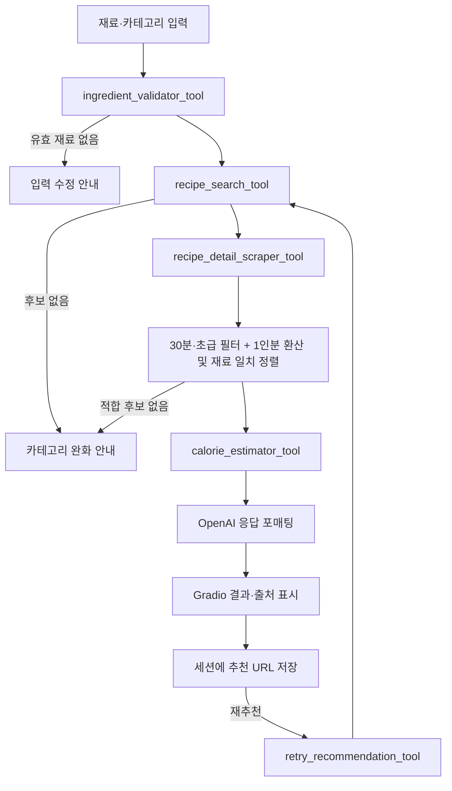

# PRD: 자취생 냉장고 털이 레시피 챗봇

| 항목 | 내용 |
|---|---|
| 프로젝트명 | 냉털 레시피 챗봇 |
| 문서 버전 | v2.0 최종 수정본 |
| 작성일 | 2026-06-24 |
| 프로젝트 기간 | 2026-06-24 ~ 2026-06-25 |
| 서비스 형태 | Gradio 기반 챗봇 MVP |
| 대상 인원 | 4명 |
| 핵심 외부 서비스 | OpenAI API, Tavily Search API, 만개의레시피 웹페이지 |

## 1. 요구사항 해석

본 프로젝트는 사용자가 냉장고 속 식재료와 원하는 음식 카테고리를 입력하면 실제 식재료를 판별하고, Tavily로 만개의레시피 후보를 실시간 검색한 뒤 자취생이 만들기 쉬운 레시피를 추천하는 Gradio 챗봇이다. 추천 결과에는 메뉴명, 썸네일, 인분, 조리시간, 난이도, 조리 정보, 1인분 예상 칼로리, 출처 링크를 포함한다. 사용자가 결과를 원하지 않으면 같은 조건 또는 변경된 조건으로 이전 결과를 제외하고 재추천한다.

결과물 유형은 다음과 같다.

- 서비스 기획 및 MVP 범위 정의
- OpenAI·Tavily·웹 스크래핑 기반 시스템 설계
- 5개 Tool의 입출력 계약과 실행 순서 정의
- Gradio 화면 및 상태 관리 설계
- 외부 API·스크래핑 장애와 저작권 위험을 포함한 예외·테스트 설계
- GitHub 제출 및 4명 팀 역할 분담 설계

## 2. 프로젝트 개요

### 2.1 한 줄 소개

냉장고에 있는 식재료와 원하는 음식 카테고리를 입력하면 조건에 맞는 만개의레시피를 실시간으로 검색하고, 자취생이 만들기 쉬운 메뉴를 추천하는 챗봇 서비스다.

### 2.2 프로젝트 배경

자취생은 냉장고에 남은 재료가 있어도 만들 수 있는 음식을 바로 떠올리기 어렵다. 일반 레시피 검색에서는 조리시간이 길거나 난이도가 높은 결과가 함께 노출되어 실제로 따라 하기 쉬운 메뉴를 찾는 데 시간이 든다. 본 서비스는 보유 재료를 출발점으로 검색하고, 30분 이내·초급 또는 아무나 난이도의 레시피를 재료 양 1인분 기준으로 환산해 제공해 메뉴 선택 시간을 줄인다.

### 2.3 핵심 서비스 가치

- 메뉴명을 먼저 정하지 않아도 보유 재료에서 레시피를 찾을 수 있다.
- 자취생에게 실행 가능한 인분·시간·난이도 조건을 일관되게 적용한다.
- 추천 근거, 예상 칼로리, 원본 링크를 한 화면에서 확인할 수 있다.
- 실시간 검색으로 고정 레시피 데이터보다 다양한 후보를 탐색한다.

## 3. 문제 정의와 타깃 사용자

### 3.1 사용자 Pain Point

| 문제 | 현재 불편 | 서비스 해결 방식 |
|---|---|---|
| 메뉴 선택 | 남은 재료로 만들 메뉴가 바로 떠오르지 않음 | 재료 기반 후보 검색 |
| 검색 피로 | 긴 시간·높은 난이도 레시피가 혼재 | 30분 이내·초급/아무나 필터, 1인분 기준 환산 |
| 정보 분산 | 이미지·시간·난이도·칼로리를 따로 확인 | 추천 카드에 핵심 정보 통합 |
| 첫 결과 불만족 | 검색을 다시 시작해야 함 | 이전 추천을 제외한 재추천 |

### 3.2 주요 사용자

- 냉장고 속 식재료로 간단한 음식을 만들고 싶은 자취생
- 복잡한 조리법에 부담을 느끼는 요리 초보자
- 1~2인분, 30분 이내의 빠른 요리를 선호하는 사용자
- 남은 재료를 활용해 식비와 음식물 폐기를 줄이고 싶은 사용자

### 3.3 기존 대안과 차별점

| 대안 | 한계 | 차별점 |
|---|---|---|
| 일반 검색 | 사용자가 메뉴명과 조건을 직접 조합해야 함 | 재료 검증부터 조건 필터까지 한 흐름으로 처리 |
| 고정 레시피 데이터 | 추천 다양성과 최신성이 제한됨 | Tavily 기반 실시간 후보 검색 |
| 범용 LLM 대화 | 출처·실제 페이지 정보가 불명확할 수 있음 | 허용 도메인 검색과 원본 링크 제공 |

## 4. 프로젝트 목표와 비목표

### 4.1 서비스 및 사용자 목표

- 사용자가 보유 재료로 만들 수 있는 음식을 빠르게 찾는다.
- 30분 이내, 초급 또는 아무나 난이도의 레시피를 추천하고, 재료 양을 1인분 기준으로 환산한다.
- 메뉴 이미지, 인분, 조리시간, 난이도, 예상 칼로리를 한 번에 확인한다.
- 마음에 들지 않는 메뉴는 기존 결과를 제외하고 다시 추천받는다.
- 식재료가 아닌 입력은 추천에서 제외하고 이유를 안내한다.

### 4.2 프로젝트 목표

- OpenAI client 기반 챗봇 응답과 구조화된 결과 생성
- Tavily를 활용한 만개의레시피 실시간 검색
- 아래 5개 Tool을 독립 모듈과 테스트로 구현
  1. `ingredient_validator_tool`
  2. `recipe_search_tool`
  3. `recipe_detail_scraper_tool`
  4. `calorie_estimator_tool`
  5. `retry_recommendation_tool`
- Gradio 기반 MVP 완성
- GitHub 제출과 10분 발표가 가능한 구조·문서·테스트 확보

### 4.3 MVP 비목표

- 회원가입·로그인과 사용자 계정
- 냉장고 재료·유통기한 영구 저장
- 장바구니, 가격 계산, 결제
- 의료·영양 상담 수준의 정확한 영양 분석
- 즐겨찾기와 개인 맞춤 식단
- 다중 레시피 사이트 통합
- 대규모 트래픽과 고가용성 운영

## 5. MVP 범위와 성공 지표

### 5.1 포함 기능

- 재료별 독립 입력 필드 5개를 통한 식재료 입력
- 실제 식재료 판별, 정규화, 중복 제거, 제외 항목 안내
- 한식·중식·일식·양식·분식·상관없음 카테고리 선택
- Tavily 기반 만개의레시피 후보 검색
- 상세 페이지에서 메뉴명, 썸네일, 인분, 조리시간, 난이도, 재료, 조리 정보 추출
- 30분 이내, 초급/아무나 조건 필터(인분은 제한하지 않고 1인분 기준으로 환산)
- 보유 재료 일치도 기반 정렬
- 1인분 예상 칼로리와 불확실성 안내
- 이전 추천을 제외한 재추천
- 세션 초기화와 원본 링크 제공

### 5.2 추가 기능

- 알레르기·비선호 재료 제외
- 최대 조리시간·난이도 직접 선택
- 유통기한 임박 재료 우선 추천
- 부족한 재료 장보기 목록
- 검색 결과 캐시와 최근 추천 저장
- 영양성분 공공 API 연계
- SQLite 또는 Redis 기반 상태·캐시 저장
- 독립 FastAPI 백엔드와 다중 클라이언트 지원

### 5.3 핵심 성과 지표

| 지표 | 측정 방식 | MVP 목표 |
|---|---|---|
| 유효 입력 추천 성공률 | 추천 성공 건수 / 유효 요청 건수 | 80% 이상 |
| 조건 준수율 | 30분 이내·초급/아무나를 만족하고 1인분 기준으로 환산된 추천 비율 | 100% |
| 재추천 비중복률 | 새 URL 반환 건수 / 재추천 가능 건수 | 100% |
| 정보 완전성 | 필수 상세 필드가 모두 있는 추천 비율 | 90% 이상 |
| 자동 테스트 통과율 | 필수 테스트 통과 수 / 전체 필수 테스트 수 | 100% |
| 응답 시간 | 추천 버튼부터 결과 표시까지 | 정상 외부 응답 시 10초 이내 목표 |

외부 검색과 웹페이지 응답에 의존하므로 응답 시간과 추천 성공률은 로컬 정적 앱보다 변동성이 크다. 발표 전 실제 환경에서 별도 측정한다.

## 6. 입력값과 추천 정책

### 6.1 입력값

| 항목 | 필수 | 설명 | 예시 |
|---|---:|---|---|
| 식재료 입력 1 | Y | 첫 번째 식재료 입력 필드, 한 필드에 재료 1개 입력 | `김치` |
| 식재료 입력 2~5 | N | 추가 식재료 입력 필드, 빈 필드는 무시 | `밥`, `계란`, 빈 값, 빈 값 |
| 음식 카테고리 | Y | 한식·중식·일식·양식·분식·상관없음 | `한식` |
| 재추천 요청 | N | 버튼 또는 자연어 의도 | `다시 추천해줘` |
| 변경 조건 | N | 재추천 전에 수정한 재료 필드·카테고리 | 식재료 입력 1을 `양파`로 변경, 카테고리를 `일식`으로 변경 |

식재료는 쉼표로 연결하지 않고 재료별 입력 필드에 하나씩 입력한다. MVP에서는 고정된 5개 필드를 제공한다. 첫 번째 필드는 필수이며 2~5번째 필드는 선택이다. 각 필드는 앞뒤 공백을 제외하고 최대 30자까지 허용한다.

### 6.2 필수 추천 조건

| 기준 | 조건 |
|---|---|
| 난이도 | `초급` 또는 `아무나` |
| 조리시간 | 파싱 가능한 값 기준 30분 이내 |
| 인분 | 제한하지 않음. 모든 인분을 허용하고 재료 양을 1인분 기준으로 환산 |
| 카테고리 | 사용자 선택과 일치, `상관없음`은 제한하지 않음 |
| 재료 | 유효 재료 중 1개 이상과 관련 |
| 출처 | 호스트가 `10000recipe.com` 또는 승인된 하위 도메인 |

만개의레시피에는 1인분 레시피가 드물어 **인분으로 후보를 거르지 않는다.** 대신 상세 페이지에서 얻은 `servings`로 각 재료 양을 나눠(예: `4인분 → 1/4`, `3인분 → 1/3`) 1인분 기준으로 환산해 안내하고, 환산 사실을 `1인분 (원래 4인분 기준 환산)`처럼 표시한다. `약간`·`적당량`처럼 수량이 없는 양과 숫자가 둘 이상인 복합 양은 환산하지 않고 원문을 유지한다. 환산 로직은 `services/serving_scaler.py`가 담당한다.

### 6.3 추천 우선순위

1. 보유 재료 일치 개수와 일치율
2. 카테고리 일치
3. 부족한 주요 재료 수가 적은 결과
4. `초급` 우선, 이후 `아무나`
5. 조리시간이 짧은 결과
6. 인분 수가 적어 환산 왜곡이 작은 결과 우선(예: 2인분 > 6인분)
7. 동점이면 정규화된 URL 순으로 안정 정렬

Tavily의 검색 점수만으로 최종 추천하지 않는다. 상세 페이지에서 필수 조건을 확인한 후보만 자체 점수로 재정렬한다.

## 7. 핵심 기능 명세

| 기능명 | 입력 | 처리 | 출력 | Tool | 우선순위 |
|---|---|---|---|---|---|
| 식재료 검증 | 재료 입력 필드 5개의 문자열 목록 | 빈 값 제거·정규화·실제 재료 판별 | 유효 재료, 제외 항목과 이유 | `ingredient_validator_tool` | Must |
| 레시피 검색 | 유효 재료, 카테고리 | Tavily 검색, 도메인·URL 검증, 중복 제거 | 레시피 후보 URL 목록 | `recipe_search_tool` | Must |
| 상세 정보 수집 | 후보 URL | HTML 파싱, 필드 검증, 정규화 | 썸네일·인분·시간·난이도·재료·조리 정보 | `recipe_detail_scraper_tool` | Must |
| 조건 필터·정렬 | 상세 후보 | 필수 조건 제거, 재료 일치 점수 계산 | 추천 가능한 상세 후보 순위 | 서비스 계층 | Must |
| 칼로리 추정 | 메뉴명, 재료, 인분 | OpenAI 구조화 추정, 범위·가정 검증 | 1인분 예상 kcal | `calorie_estimator_tool` | Must |
| 재추천 | 기존 결과, 최신 조건 | 이전 URL 제외 후 검색·필터 재실행 | 새로운 추천 결과 | `retry_recommendation_tool` | Must |
| 결과 표시 | 추천 결과 | 안전한 Markdown/컴포넌트 렌더링 | 추천 카드와 출처 링크 | Gradio UI | Must |
| 초기화 | 버튼 이벤트 | 입력·출력·세션 상태 제거 | 기본 화면 | Gradio UI | Must |

## 8. Tool 상세 명세

모든 Tool은 UI 컴포넌트를 직접 참조하지 않는 독립 함수로 구현한다. Pydantic 모델로 입출력을 검증하고, Tool별 단위 테스트를 제공한다. LLM이 자유롭게 순서를 결정하게 두기보다 서비스 계층이 필수 순서를 제어한다. 이는 2일 MVP에서 재현성과 오류 추적성을 높이면서도 “5개 Tool 적용”을 코드상 명확히 증명한다.

### 8.1 `ingredient_validator_tool`

**역할:** 사용자 입력 재료 → 실제 식재료 확인 → 유효 재료 리스트와 제외 항목 반환

**입력**

```json
{"ingredient_inputs": ["김치", "밥", "계란", "핸드폰", ""]}
```

**처리**

1. 5개 입력 필드의 문자열 목록을 전달받고 빈 필드를 제거한다.
2. 각 필드의 앞뒤 공백 제거, 연속 공백 축소, 별칭 치환(`달걀 → 계란`)을 수행한다.
3. 한 필드에 쉼표나 줄바꿈으로 여러 재료가 입력되면 자동 분리하지 않고 입력 형식 오류로 안내한다.
4. 입력 순서를 유지하며 중복을 제거한다.
5. 로컬 식재료 사전과 일치하는 항목은 즉시 유효 처리한다.
6. 사전에 없는 항목만 OpenAI에 구조화 판별을 요청한다.
7. 낮은 신뢰도·모호한 항목은 유효 재료로 추측하지 않고 제외 또는 확인 필요로 분류한다.

**출력**

```json
{
  "valid_ingredients": ["김치", "밥", "계란"],
  "excluded_items": [
    {"item": "핸드폰", "reason": "식재료가 아님"}
  ],
  "warnings": []
}
```

**검증 규칙:** 입력은 길이 5의 문자열 목록이며 필드당 최대 30자다. 첫 번째 필드가 비어 있거나 전체 유효 재료가 0개면 이후 Tool을 호출하지 않는다. 한 필드에 여러 재료를 입력하거나 6개 이상의 값을 직접 전달하면 입력 오류로 처리한다. OpenAI 장애 시 사전 일치 항목만 사용하고 나머지는 `판별 보류`로 안내한다.

### 8.2 `recipe_search_tool`

**역할:** 유효 재료와 음식 카테고리 → 조건에 맞는 레시피 검색 → 후보 목록 반환

**입력**

```json
{
  "valid_ingredients": ["김치", "밥", "계란"],
  "category": "한식",
  "exclude_urls": []
}
```

**처리**

- 검색어 예시: `김치 밥 계란 한식 1인분 2인분 30분 이내 초급 레시피`
- Tavily `include_domains=["10000recipe.com"]`로 출처를 제한한다.
- MVP에서는 `search_depth="basic"`, `max_results=5~8`, `include_answer=False`를 권장한다.
- 결과 URL의 스킴은 HTTPS, 호스트는 허용 목록, 경로는 레시피 상세 패턴인지 재검증한다.
- 쿼리 파라미터와 프래그먼트를 제거해 URL을 정규화하고 중복·이전 추천 URL을 제외한다.

**출력**

```json
{
  "candidates": [
    {
      "title": "김치볶음밥",
      "url": "https://www.10000recipe.com/recipe/0000000",
      "search_score": 0.82
    }
  ],
  "query": "김치 밥 계란 한식 ..."
}
```

검색 결과의 제목·요약은 아직 검증되지 않은 데이터다. 인분·시간·난이도는 이 Tool에서 단정하지 않고 상세 스크래퍼 결과로 확인한다.

### 8.3 `recipe_detail_scraper_tool`

**역할:** 레시피 URL → 썸네일, 인분, 조리시간, 난이도, 조리법 → 상세 레시피 정보 반환

**입력:** 검증된 만개의레시피 HTTPS URL 1개

**처리 순서**

1. 요청 전 URL을 다시 검증해 SSRF와 임의 도메인 접근을 차단한다.
2. 명시적 User-Agent, 연결·읽기 타임아웃, 최대 응답 크기를 적용한다.
3. 성공 응답과 HTML 콘텐츠 유형만 파싱한다.
4. 구조화 데이터(JSON-LD)가 있으면 우선 사용하고, 없으면 검수된 CSS 선택자를 사용한다.
5. 메뉴명, 대표 이미지 URL, 인분, 시간, 난이도, 재료, 조리 단계, 원본 URL을 추출한다.
6. 인분·시간을 정수로 정규화하고 원문도 보존한다.
7. 추출한 `servings`로 각 재료 양을 1인분 기준으로 환산한다(`services/serving_scaler`). 수량이 없는 양(`약간`)과 복합 양은 원문을 유지하고, 환산 후 `serving_text`에 원래 인분을 함께 남긴다.
8. 필수 필드가 없거나 조건을 파싱할 수 없으면 후보를 제외하고 원인을 남긴다.

**선택자 전략**

- 인분: `.view2_summary_info1`
- 조리시간: `.view2_summary_info2`
- 난이도: `.view2_summary_info3`
- 썸네일·제목·재료·단계는 실제 샘플 HTML fixture를 기준으로 확정한다.
- 단일 선택자에 의존하지 않고 `primary selectors → fallback selectors → 실패` 순서를 사용한다.

**출력**

```json
{
  "title": "김치볶음밥",
  "source": "만개의레시피",
  "source_url": "https://www.10000recipe.com/recipe/0000000",
  "image_url": "https://...",
  "servings": 2,
  "serving_text": "2인분",
  "cooking_time_minutes": 30,
  "cooking_time_text": "30분 이내",
  "difficulty": "초급",
  "ingredients": [{"name": "김치", "amount": "1컵"}],
  "cooking_steps": ["..."],
  "scraped_at": "ISO-8601 timestamp"
}
```

**저작권·운영 게이트**

만개의레시피의 공개 레시피 페이지에는 이미지와 문구의 무단 복제를 금지하는 고지가 표시되는 사례가 확인된다. 따라서 배포 전에 이용약관·robots 정책·콘텐츠 사용 허용 범위를 직접 확인하고 필요한 경우 서면 허가를 받아야 한다. 허용 여부가 확인되지 않은 기본 모드에서는 원본 이미지와 조리 문구를 저장·재배포하지 않고, 필터에 필요한 메타데이터와 원본 링크 중심으로 표시한다. 전체 조리법과 썸네일 노출은 권한 확인 후 활성화한다. 이 조건은 선택 사항이 아니라 배포 차단 기준이다.

### 8.4 `calorie_estimator_tool`

**역할:** 메뉴명과 재료 → 1인분 예상 칼로리 추정 → 예상 kcal 반환

**입력**

```json
{
  "menu_name": "김치볶음밥",
  "ingredients": [
    {"name": "밥", "amount": "200g"},
    {"name": "김치", "amount": "100g"},
    {"name": "계란", "amount": "1개"}
  ],
  "servings": 2
}
```

**처리**

- OpenAI에 메뉴명·재료·수량·인분만 제공하고 구조화된 JSON으로 추정받는다.
- 1인분 중심값과 최소·최대 범위, 주요 가정, 신뢰도를 반환한다.
- 수량이 없거나 인분이 불명확하면 낮은 신뢰도로 표시하고 넓은 범위를 사용한다.
- 음수·비정상 범위·필드 누락 결과는 폐기하고 1회만 재시도한다.
- 실패 시 유사 메뉴 값을 임의로 확정하지 않고 `칼로리 추정 불가`를 표시한다.

**출력**

```json
{
  "estimated_kcal_per_serving": 550,
  "range_min": 480,
  "range_max": 650,
  "confidence": "medium",
  "assumptions": ["식용유 1큰술 사용 가정"],
  "disclaimer": "실제 칼로리는 재료의 양, 제품, 조리 방식에 따라 달라질 수 있습니다."
}
```

정확한 영양성분이나 의료적 조언으로 표현하지 않는다. 발표에서도 “AI 기반 참고용 추정치”라고 명시한다.

### 8.5 `retry_recommendation_tool`

**역할:** 기존 추천 결과와 최신 사용자 조건 → 이전 추천 제외 → 새로운 추천 결과 반환

**입력**

```json
{
  "valid_ingredients": ["김치", "밥", "계란"],
  "category": "한식",
  "previous_recipe_urls": ["https://www.10000recipe.com/recipe/0000000"]
}
```

**처리**

1. 현재 UI의 재료·카테고리를 다시 읽어 조건 변경을 반영한다.
2. 기존 추천 URL을 제외 목록에 넣는다.
3. 캐시된 미추천 후보가 있으면 먼저 사용한다.
4. 없으면 `recipe_search_tool`부터 파이프라인을 다시 실행한다.
5. 조건을 충족하는 새 후보가 없으면 같은 결과를 반복하지 않고 조건 변경을 안내한다.

**출력:** 새로운 `RecommendationResult` 또는 `NO_NEW_CANDIDATE` 상태

세션 이력은 서버 전역 변수가 아닌 `gr.State`에 저장한다. URL뿐 아니라 정규화된 메뉴명도 보조 중복 키로 사용한다.

## 9. 서비스 동작 흐름



### 9.1 최초 추천 실행 순서

1. 입력 길이와 카테고리를 검증한다.
2. `ingredient_validator_tool`이 유효 재료와 제외 항목을 반환한다.
3. `recipe_search_tool`이 Tavily에서 최대 5~8개 URL을 확보한다.
4. `recipe_detail_scraper_tool`을 후보별로 실행한다. 과도한 병렬 요청은 금지한다.
5. 서비스 계층이 30분·초급/아무나 조건을 필터링하고, 인분은 거르지 않고 재료 양을 1인분 기준으로 환산한다.
6. 보유 재료 일치도와 부족 재료 수로 정렬해 1개를 선택한다.
7. `calorie_estimator_tool`이 1인분 kcal를 추정한다.
8. OpenAI는 검증된 구조화 결과만 사용해 사용자용 문장을 만든다.
9. Gradio가 결과와 원본 링크를 표시하고 추천 URL을 세션에 저장한다.

### 9.2 재추천 실행 순서

1. 재추천 버튼 클릭 또는 재추천 의도를 감지한다.
2. 최신 UI 조건과 세션의 이전 URL을 `retry_recommendation_tool`에 전달한다.
3. 남은 캐시 후보가 있으면 외부 검색 없이 사용한다.
4. 남은 후보가 없으면 이전 URL을 제외해 새 검색을 수행한다.
5. 후보 소진 시 카테고리를 `상관없음`으로 바꾸거나 재료를 추가하도록 안내한다.

## 10. OpenAI 사용 설계

### 10.1 권장 API 방식

신규 프로젝트에는 OpenAI 공식 Python SDK의 Responses API 사용을 권장한다. 모델명은 코드에 고정하지 않고 `OPENAI_MODEL` 환경변수로 관리하며, 팀이 실제 접근 가능한 모델을 설치·통합 테스트 후 확정한다.

OpenAI의 책임은 다음으로 제한한다.

- 사전에 없는 단어의 식재료 여부를 구조화 판별
- 재료·수량 기반 칼로리 범위 추정
- 검증된 추천 결과를 자연스러운 챗봇 문장으로 변환
- `다시 추천해줘` 같은 간단한 사용자 의도 판별

OpenAI가 레시피 URL, 인분, 조리시간, 난이도, 출처를 임의 생성하게 하지 않는다. 해당 값은 Tavily와 상세 페이지 검증 결과만 사용한다.

### 10.2 Tool 오케스트레이션 방식

MVP에서는 “LLM 자율 에이전트”보다 애플리케이션의 결정적 파이프라인을 권장한다.

- 장점: Tool 호출 순서가 일정하고 디버깅·발표가 쉽다.
- 장점: 검색 실패 시 스크래핑·칼로리 Tool을 불필요하게 호출하지 않는다.
- 장점: API 비용과 무한 Tool 호출 위험을 통제할 수 있다.
- Tool 함수는 OpenAI function calling 스키마로도 노출 가능하지만, 필수 흐름은 서비스 계층이 보장한다.

과제에서 `ChatOpenAI` 사용이 필수라면 `langchain-openai` 어댑터를 사용할 수 있다. 그러나 공식 `OpenAI` client와 `ChatOpenAI`를 동시에 핵심 경로에 두지 않는다. 본 최종안은 사용자가 예정한 OpenAI client를 기준으로 한다.

### 10.3 보안과 비용 통제

- `OPENAI_API_KEY`, `TAVILY_API_KEY`는 서버 환경변수에서만 읽는다.
- `.env`는 Git에서 제외하고 `.env.example`에는 변수명만 둔다.
- 요청당 최대 외부 검색 1회, 상세 페이지 5~8개, OpenAI 호출 2~3회를 상한으로 둔다.
- 타임아웃, 재시도 횟수, 최대 출력 토큰, 동시 요청 수를 제한한다.
- 외부 HTML은 신뢰할 수 없는 데이터로 취급하고 스크립트·숨김 텍스트를 제거한 뒤 길이를 제한한다.
- 스크랩 텍스트 안의 지시문이 시스템 프롬프트나 Tool 순서를 바꾸지 못하게 한다.
- 운영 시 OpenAI 요청 ID와 내부 추적 ID를 기록하되 API 키·사용자 원문은 로그에 남기지 않는다.

## 11. FastAPI 도입 판단

### 11.1 결론

**현재 2일 Gradio MVP에는 별도 FastAPI 배포를 권장하지 않는다.** Gradio도 서버 측 Python에서 OpenAI·Tavily를 호출하므로 API 키를 브라우저에 노출하지 않고 구현할 수 있다. 별도 FastAPI를 추가하면 배포 대상, CORS, 인증, 네트워크 오류, 요청 모델, 상태 동기화가 늘어나 일정 대비 이점이 작다.

### 11.2 MVP 권장 구조

```text
Browser → Gradio app → RecommendationService → 5 Tools
                                      ├→ OpenAI API
                                      ├→ Tavily API
                                      └→ 허용된 레시피 URL
```

UI와 Tool 사이에 `RecommendationService`를 두어 향후 FastAPI에서도 같은 로직을 재사용한다. Gradio 이벤트 함수에 OpenAI·검색·스크래핑 코드를 직접 작성하지 않는다.

### 11.3 FastAPI를 추가해야 하는 조건

다음 중 하나가 실제 요구사항이 되면 2단계에서 FastAPI를 도입한다.

- 모바일 앱·React 등 Gradio 외 클라이언트가 필요함
- 프론트엔드와 백엔드를 독립 배포·확장해야 함
- 인증, 사용자별 사용량 제한, API 버전 관리가 필요함
- 외부 팀이 OpenAPI 계약으로 기능을 호출해야 함
- 백엔드 부하와 로그를 UI와 독립적으로 운영해야 함

권장 엔드포인트는 `POST /v1/recommendations`, `POST /v1/recommendations/retry`, `GET /health`다. 공개 배포 시 인증·rate limit·허용 CORS·HTTPS·프로세스 자동 재시작을 함께 설계해야 한다. FastAPI 자체만 추가한다고 운영 보안이나 안정성이 자동으로 확보되는 것은 아니다.

### 11.4 대안

- **MVP:** Gradio 단일 앱 배포
- **중간 단계:** 동일 프로세스에 FastAPI와 Gradio를 구성하되 서비스 계층 공유
- **확장 단계:** Gradio UI와 FastAPI API를 독립 배포하고 Redis/DB로 상태 공유

## 12. 화면 구성

### 12.1 Gradio 컴포넌트

| 요소 | 컴포넌트 | 역할 |
|---|---|---|
| 제목·안내 | `gr.Markdown` | 입력 방법, 출처, 칼로리 면책 안내 |
| 식재료 입력 1 | `gr.Textbox` | 필수, 재료 1개, 최대 30자 |
| 식재료 입력 2~5 | `gr.Textbox` × 4 | 선택, 각 필드에 재료 1개, 빈 값 허용 |
| 카테고리 | `gr.Dropdown` | 6개 옵션, 기본값 `상관없음` |
| 추천 | `gr.Button` | 최초 파이프라인 실행 |
| 재추천 | `gr.Button` | 이전 결과 제외 후 재실행 |
| 초기화 | `gr.Button` | 입력·대화·추천 이력 초기화 |
| 대화 | `gr.Chatbot` | 사용자 요청과 결과 요약 |
| 썸네일 | `gr.Image` 또는 안전한 Markdown | 권한 확인 시 원격 이미지 표시 |
| 상세 결과 | `gr.Markdown` | 인분·시간·난이도·칼로리·출처 표시 |
| 상태 | `gr.State` | 이전 URL, 후보 캐시, 마지막 유효 조건 |

### 12.2 결과 표시 순서

1. 제외된 입력 항목과 이유
2. 추천 메뉴명과 추천 이유
3. 썸네일(사용 허용 확인 시)
4. 인분, 조리시간, 난이도
5. 활용 가능한 보유 재료와 부족한 재료
6. 조리 정보(콘텐츠 사용 허용 범위 내)
7. 1인분 예상 칼로리 범위와 신뢰도
8. 원본 레시피 링크와 출처
9. 재추천 안내

## 13. 데이터 모델과 상태

### 13.1 주요 모델

```text
IngredientValidationResult
- valid_ingredients: list[str]
- excluded_items: list[ExcludedItem]
- warnings: list[str]

RecipeCandidate
- title: str
- url: HttpUrl
- search_score: float | None

RecipeDetail
- title: str
- source_url: HttpUrl
- image_url: HttpUrl | None
- servings: int | None
- cooking_time_minutes: int | None
- difficulty: str | None
- ingredients: list[IngredientAmount]
- cooking_steps: list[str]
- scraped_at: datetime

CalorieEstimate
- estimated_kcal_per_serving: int | None
- range_min: int | None
- range_max: int | None
- confidence: Literal["low", "medium", "high"]
- assumptions: list[str]
- disclaimer: str

RecommendationState
- previous_recipe_urls: list[str]
- normalized_menu_names: list[str]
- cached_candidates: list[RecipeDetail]
- last_valid_ingredients: list[str]
- last_category: str
```

### 13.2 데이터베이스 사용 여부

MVP에서는 DB를 사용하지 않는다.

- 세션 데이터: `gr.State`
- 식재료 별칭·기본 사전: `data/*.json`
- 테스트용 검색 결과·HTML: `tests/fixtures/`
- 앱 재시작 시 추천 이력이 사라지는 것은 의도된 동작

캐시·즐겨찾기·다중 인스턴스가 필요해질 때 SQLite 또는 Redis를 검토한다.

## 14. 기술 스택

| 구분 | 기술 | 목적 |
|---|---|---|
| Language | Python 3.11 권장 | 개발·배포 호환성 |
| UI | Gradio | 챗봇 UI와 세션 상태 |
| LLM | OpenAI Python SDK, Responses API | 판별·칼로리 추정·응답 포매팅 |
| Search | Tavily Python SDK | 만개의레시피 URL 실시간 검색 |
| HTTP | `httpx` | 타임아웃·리다이렉트 제어가 가능한 요청 |
| Scraping | BeautifulSoup4 | 허용된 HTML 필드 파싱 |
| Validation | Pydantic | Tool 입출력·URL·OpenAI 결과 검증 |
| Config | python-dotenv | 로컬 환경변수 로드 |
| Test | pytest, pytest-asyncio, respx | 단위·비동기·HTTP mock 테스트 |
| DB | 없음 | 2일 MVP 범위 축소 |
| Deployment | Local 우선, Hugging Face Spaces 선택 | Gradio 시연 |
| Dev Tool | VSCode, Git, GitHub | 개발·협업·제출 |
| AI Coding Assistant | Codex, ChatGPT 등 | 코드 초안·테스트 보조, 팀 최종 검증 |

### 14.1 `requirements.txt` 제안

실제 구현 후 테스트한 정확한 버전으로 고정한다. 아래는 패키지 구성안이며 최종 버전 핀은 개발 환경에서 확정한다.

```text
gradio
openai
tavily-python
beautifulsoup4
httpx
pydantic
python-dotenv
```

`requirements-dev.txt`:

```text
-r requirements.txt
pytest
pytest-asyncio
respx
```

과제에서 `ChatOpenAI`가 필수일 때만 `langchain-openai`를 추가한다. 사용하지 않는 `langchain`, `langchain-community`, `pandas`, `requests`를 관성적으로 넣지 않는다.

### 14.2 환경변수

```text
OPENAI_API_KEY=
OPENAI_MODEL=
TAVILY_API_KEY=
REQUEST_TIMEOUT_SECONDS=8
MAX_SEARCH_RESULTS=5
ENABLE_RECIPE_CONTENT_DISPLAY=false
```

`ENABLE_RECIPE_CONTENT_DISPLAY`는 출처의 콘텐츠 사용 허용이 확인되기 전까지 `false`가 기본값이다.

## 15. GitHub 제출 구조

```text
refrigerator-recipe-chatbot/
├── app.py
├── config.py
├── clients/
│   ├── openai_client.py
│   ├── tavily_client.py
│   └── recipe_http_client.py
├── services/
│   └── recommendation_service.py
├── tools/
│   ├── ingredient_validator_tool.py
│   ├── recipe_search_tool.py
│   ├── recipe_detail_scraper_tool.py
│   ├── calorie_estimator_tool.py
│   └── retry_recommendation_tool.py
├── models/
│   └── schemas.py
├── prompts/
│   ├── ingredient_validation.md
│   ├── calorie_estimation.md
│   └── response_format.md
├── data/
│   ├── ingredient_aliases.json
│   └── known_ingredients.json
├── tests/
│   ├── fixtures/
│   │   ├── tavily_search_response.json
│   │   └── recipe_detail_sample.html
│   ├── test_ingredient_validator_tool.py
│   ├── test_recipe_search_tool.py
│   ├── test_recipe_detail_scraper_tool.py
│   ├── test_calorie_estimator_tool.py
│   ├── test_retry_recommendation_tool.py
│   └── test_recommendation_service.py
├── .env.example
├── .gitignore
├── requirements.txt
├── requirements-dev.txt
├── README.md
└── PRD.md
```

FastAPI를 2단계에서 도입할 때만 `api/main.py`, `api/routes/recommendations.py`를 추가한다. Tool 로직은 `api/`로 이동하지 않고 서비스 계층을 재사용한다.

## 16. 팀원 역할 분담

각 팀원은 최소 1개 Tool의 구현, 단위 테스트, 발표 설명을 완료해야 한다.

| 팀원 | 담당 Tool | 추가 역할 | 완료 기준 |
|---|---|---|---|
| A | `ingredient_validator_tool` | Gradio 입력·상태·초기화 | 정상·중복·비식재료·OpenAI 실패 테스트 통과 |
| B | `recipe_search_tool` | Tavily client와 검색 쿼리 정책 | 도메인 제한·URL 중복·빈 결과·API 실패 테스트 통과 |
| C | `recipe_detail_scraper_tool` | HTML fixture와 콘텐츠 사용 범위 확인 | 필드 파싱·누락·타임아웃·SSRF·HTML 변경 테스트 통과 |
| D | `calorie_estimator_tool`, `retry_recommendation_tool` | OpenAI client·전체 통합·배포 | 구조 검증·추정 실패·비중복·후보 소진 테스트 통과 |

협업 시작 전에 Pydantic 스키마와 예외 코드를 합의한다. PR에는 코드, 담당 Tool 테스트, 샘플 출력, 외부 호출 mock을 포함한다.

## 17. 예외 처리

| 상황 | 처리 기준 | 사용자 응답 | 후속 동작 |
|---|---|---|---|
| 재료 미입력 | 정규화 후 0개 | 입력 예시 안내 | 전체 중단 |
| 첫 번째 재료 필드 미입력 | 첫 필드는 비어 있고 선택 필드만 입력 | “첫 번째 식재료를 입력해 주세요.” | 검증 중단 |
| 비식재료 포함 | 판별 결과 invalid | 제외 항목과 이유 표시 | 유효 재료만 계속 |
| 유효 재료 0개 | 전부 제외·보류 | 재입력 요청 | 검색 미호출 |
| 한 필드에 여러 재료 입력 | 쉼표·줄바꿈 포함 | “한 입력칸에는 재료를 하나만 입력해 주세요.” | 검증 중단 |
| 입력 필드 값 과다 | Tool에 6개 이상 전달 | “식재료는 최대 5개까지 입력할 수 있습니다.” | 검증 중단 |
| 카테고리 누락 | 허용값 아님 | 카테고리 선택 요청 | 검색 미호출 |
| OpenAI 인증·제한 오류 | SDK 오류 | 현재 기능 일시 제한 안내 | 사전 기반 검증 또는 칼로리 생략 |
| Tavily 오류·타임아웃 | 검색 예외 | 잠시 후 재시도 안내 | 최대 1회 재시도 후 중단 |
| 검색 후보 없음 | 결과 0개 | `상관없음` 또는 재료 추가 안내 | 이력 변경 없음 |
| 허용 외 URL | 호스트·스킴 불일치 | 사용자에게 노출하지 않음 | 후보 폐기·보안 로그 |
| 상세 페이지 접근 실패 | 4xx·5xx·타임아웃 | 다른 후보 탐색 | 다음 후보 진행 |
| 필드 누락 | 인분·시간·난이도 파싱 불가 | 별도 노출 없음 | 후보 제외 |
| 조건 불일치 | 30분 초과·중급 이상 | 별도 노출 없음 | 후보 제외(인분은 제외 사유 아님) |
| 이미지 실패 | URL 없음·로드 실패 | 이미지 없음 표시 | 텍스트 결과 유지 |
| 칼로리 실패 | 구조 검증·재시도 실패 | 추정 불가와 이유 표시 | 메뉴 추천은 유지 |
| 후보 소진 | 모든 URL 추천됨 | 조건 변경 안내 | 같은 결과 반복 금지 |
| HTML 구조 변경 | 필수 선택자 전체 실패 | 추천 일시 제한 안내 | fixture/선택자 수정 이슈 생성 |

## 18. 자체 시뮬레이션과 오류 가능성

### 18.1 정상 흐름 시뮬레이션

**입력:** 식재료 필드 `[김치] [밥] [계란] [핸드폰] [빈 값]` / 카테고리 `한식`

1. validator가 `김치, 밥, 계란`을 유효 재료로, `핸드폰`을 제외 항목으로 반환한다.
2. search가 허용 도메인에서 5개 후보 URL을 반환하고 URL 중복을 제거한다.
3. scraper가 각 후보의 인분·시간·난이도를 파싱하고 재료 양을 1인분 기준으로 환산한다.
4. 30분 초과, 중급 후보가 제거된다(인분은 제거 사유가 아님).
5. 남은 후보를 재료 일치도로 정렬해 김치볶음밥을 선택한다.
6. calorie estimator가 1인분 예상 범위와 가정을 반환한다.
7. Gradio가 제외 항목, 추천 이유, 상세 정보, 칼로리 면책, 원본 링크를 표시한다.
8. 재추천 시 해당 URL과 메뉴명이 제외되고 다음 후보가 선택된다.

### 18.2 주요 오류 위험과 안정적 대응

| 위험 | 원인 | 최소 수정안 | 안정적 대안·재발 방지 |
|---|---|---|---|
| 검색은 되지만 조건이 맞지 않음 | Tavily 요약만으로 조건 판단 | 상세 페이지 후필터 | 후보 수를 제한적으로 늘리되 비용 상한 유지 |
| 스크래퍼 전체 실패 | CSS 클래스 변경 | fallback selector 갱신 | fixture·주기적 smoke test, 가능하면 공식 API 전환 |
| 저작권 문제 | 이미지·문구 재게시 | 콘텐츠 표시 플래그 비활성화 | 허가 확보 전 메타데이터·출처 링크만 제공 |
| SSRF | 검색 결과 URL을 그대로 요청 | 스킴·호스트·경로 검증 | 리다이렉트 후 최종 URL도 재검증 |
| 프롬프트 인젝션 | 외부 HTML에 악성 지시 포함 | 텍스트를 데이터 필드로 격리 | 스크립트 제거·길이 제한·Tool 권한 고정 |
| 예상 칼로리 오해 | 수량 누락·LLM 추정 | 범위·가정·신뢰도 표시 | 공인 영양 데이터 API로 교체 |
| 재추천 중복 | URL 표기 차이 | URL 정규화 | 메뉴명 정규화도 보조 키로 사용 |
| API 비용 급증 | 재시도·후보 수 무제한 | 호출 상한과 타임아웃 | 캐시·사용량 모니터링·rate limit |
| 세션 간 이력 혼합 | 전역 리스트 사용 | `gr.State` 사용 | 독립 세션 통합 테스트 |

### 18.3 남은 불확실성

- 만개의레시피의 자동 수집과 이미지·조리 문구 표시 허용 범위는 개발 전 직접 확인해야 한다.
- 실제 HTML 선택자는 샘플 페이지 여러 건으로 검증해야 하며 첨부 문서의 클래스명만으로 완성됐다고 볼 수 없다.
- OpenAI 모델은 프로젝트 계정에서 사용 가능한 모델과 비용을 확인한 뒤 `OPENAI_MODEL`로 확정해야 한다.
- 외부 API와 사이트가 발표 당일 정상 응답한다는 보장이 없으므로, 발표용 mock/demo fallback을 별도로 준비해야 한다.

## 19. 테스트 계획

### 19.1 단위 테스트

| 구분 | 입력·조건 | 기대 결과 |
|---|---|---|
| 정상 재료 | `["김치", "밥", "계란", "", ""]` | 3개 유효 재료, 빈 필드 무시 |
| 중복·별칭 | `["계란", "달걀", "계란", "", ""]` | `계란` 1개 |
| 비식재료 | `["김치", "핸드폰", "", "", ""]` | 김치 유효, 핸드폰 제외 |
| 빈 값 | `["", " ", "", "", ""]` 또는 None | 사용자 입력 오류 |
| 첫 필드 누락 | `["", "밥", "계란", "", ""]` | 첫 번째 필드 입력 요청 |
| 필드 내부 구분자 | 첫 필드에 `김치, 밥` | 자동 분리하지 않고 입력 형식 오류 |
| 경계값 | 5개/6개 필드 값 | 5개 허용, 6개 거부 |
| 필드 길이 | 30자/31자 | 30자 허용, 31자 거부 |
| OpenAI 실패 | validator fallback | 사전 일치만 유효, 나머지 보류 |
| Tavily 도메인 | 외부 도메인 포함 mock | 외부 URL 제거 |
| URL 중복 | 쿼리만 다른 같은 레시피 | 1개로 정규화 |
| 검색 빈 결과 | candidates 0개 | 명시적 `NO_CANDIDATE` |
| 스크래핑 정상 | 고정 HTML fixture | 모든 필드 정확히 파싱 |
| 스크래핑 누락 | 난이도 태그 없음 | 후보 제외 사유 반환 |
| 리다이렉트 | 허용 외 도메인으로 이동 | 접근 중단 |
| 시간 파싱 | `30분 이내`, `1시간 이내` | 30, 60으로 정규화 |
| 조건 필터 | 40분·중급 | 후보 제거(인분은 제거 사유 아님) |
| 인분 환산 | 4인분 레시피, 재료 `400g`·`1컵` | `100g`·`1/4컵`으로 환산, `약간`은 원문 유지 |
| 칼로리 정상 | 검증된 OpenAI mock JSON | 1인분 값·범위 반환 |
| 칼로리 역전 | min > max | 검증 실패·1회 재시도 |
| 재추천 | 이전 URL 포함 | 다른 URL 반환 |
| 후보 소진 | 모든 URL 제외 | `NO_NEW_CANDIDATE` |

### 19.2 통합·인수 테스트

- 외부 API는 mock하고 최초 추천 Tool 호출 순서와 중단 조건을 검증한다.
- 잘못된 입력에서 Tavily와 scraper가 호출되지 않는지 확인한다.
- 상세 후보가 모두 조건 탈락하면 칼로리 Tool이 호출되지 않는지 확인한다.
- OpenAI 칼로리 호출이 실패해도 추천 메뉴와 원본 링크는 유지되는지 확인한다.
- 독립된 두 `gr.State`가 추천 이력을 공유하지 않는지 확인한다.
- 초기화 후 입력, 결과, 대화, URL 이력이 모두 비워지는지 확인한다.
- 실제 Tavily와 레시피 사이트를 호출하는 smoke test는 수동·저빈도로 분리하고 CI에서는 실행하지 않는다.
- 새 가상환경에서 README 절차만으로 설치·테스트·실행되는지 확인한다.

### 19.3 발표 전 체크

- API 키와 할당량 확인
- 대표 입력 3개에 대한 실시간 검색 확인
- HTML selector smoke test 확인
- 네트워크 실패 시 mock demo 전환 절차 확인
- 콘텐츠 표시 플래그와 사용 권한 확인
- `.env`, API 키, 원문 응답이 Git에 없는지 확인

## 20. 완료 기준

- 식재료와 카테고리를 입력하면 유효·제외 재료가 구분된다.
- Tavily 검색 결과가 허용된 만개의레시피 URL로 제한된다.
- 추천은 30분 이내, 초급/아무나 조건을 만족하고 재료 양이 1인분 기준으로 환산되어 표시된다.
- 메뉴명, 인분, 시간, 난이도, 1인분 예상 칼로리, 원본 링크가 표시된다.
- 조리 정보와 이미지는 확인된 콘텐츠 사용 범위 안에서만 표시된다.
- 재추천 시 이전 URL과 동일 메뉴가 반복되지 않는다.
- 5개 Tool이 지정된 파일명·함수명과 독립 테스트를 가진다.
- 팀원 4명 모두 최소 1개 Tool의 구현·테스트를 완료한다.
- 필수 단위·통합 테스트가 모두 통과한다.
- `python app.py`로 Gradio 앱이 실행된다.
- GitHub에 코드, 테스트, README, PRD, 의존성, `.env.example`이 정리된다.
- 실제 비밀값과 불필요한 스크랩 콘텐츠가 저장소에 포함되지 않는다.

## 21. 개발 일정

| 일자 | 우선 작업 | 산출물 |
|---|---|---|
| 6/24 오전 | 스키마·Tool 계약·콘텐츠 사용 범위·환경 설정 확정 | PRD v2.0, Pydantic 모델, fixture |
| 6/24 오후 | 팀원별 5개 Tool과 단위 테스트 병렬 구현 | `tools/`, `tests/` |
| 6/25 오전 | 서비스 계층·Gradio UI 통합, mock 통합 테스트 | `app.py`, `services/` |
| 6/25 오후 | 실환경 smoke test, 예외 수정, README·발표 준비 | 실행본, GitHub, 발표 자료 |

2일 일정상 별도 FastAPI, DB, 로그인, 다중 사이트 검색은 추가하지 않는다.

## 22. 운영·확장 방향

### 22.1 MVP 운영

- 사용자 입력과 추천 이력을 영구 수집하지 않는다.
- API 사용량, 검색 실패율, 스크래핑 필드 누락률만 최소한으로 관찰한다.
- 사이트 HTML 변경이 감지되면 무리한 추정 대신 해당 후보를 제외한다.
- 레시피 콘텐츠를 캐시하거나 저장하기 전 출처 정책을 재검토한다.

### 22.2 수익화 가능성

MVP에서는 수익화를 구현하지 않는다. 확장 후 부족 재료 장보기 제휴나 식품 브랜드 협찬을 검토할 수 있으나, 광고·제휴 결과는 일반 추천과 명확히 구분해야 한다. 사용자 수요와 콘텐츠 사용 권한이 확인되기 전에는 개발 범위를 넓히지 않는다.

### 22.3 개선 방향

- 공인 영양 데이터 기반 칼로리 계산으로 교체
- 공식 레시피 API 또는 허가된 데이터 공급원 확보
- 캐시를 통한 외부 API 비용·응답 시간 절감
- 알레르기·비선호 재료 제외와 안전 경고
- FastAPI 백엔드, 인증, rate limit, Redis 도입
- 추천 만족도 피드백으로 랭킹 가중치 개선

## 23. 발표 계획

1. 프로젝트와 사용자 문제 소개
2. 1인분 환산·30분·초급 중심 MVP 범위
3. 5개 Tool의 입력·출력과 역할 분담
4. Tavily 검색과 상세 검증의 차이
5. OpenAI 사용 범위와 환각 방지 방식
6. Gradio 서비스 시연과 재추천
7. 테스트·예외·콘텐츠 사용 리스크
8. FastAPI 미도입 판단과 향후 확장

## 24. 최종 산출물

- `PRD.md`
- GitHub 저장소 URL
- `README.md`
- `requirements.txt`, `requirements-dev.txt`
- `app.py`, `config.py`
- `clients/`, `services/`, `tools/`, `models/`, `prompts/`, `data/`, `tests/`
- 실행 화면 또는 시연 영상
- 팀원별 Tool 담당표와 테스트 결과
- Slack 기술 스택 요약

## 25. 참고 근거

- OpenAI는 신규 프로젝트에 Responses API 사용을 권장한다: [Migrate to the Responses API](https://platform.openai.com/docs/guides/migrate-to-responses)
- OpenAI API 키는 브라우저 코드에 노출하지 않고 서버 환경변수 또는 키 관리 서비스에서 로드해야 한다: [OpenAI API Reference](https://platform.openai.com/docs/api-reference/authentication)
- Tavily Search는 `include_domains`, `max_results`, 검색 깊이 등의 설정을 제공한다: [Tavily Search API](https://docs.tavily.com/documentation/api-reference/endpoint/search)
- FastAPI 배포는 HTTPS, 시작·재시작, worker, 메모리 등 별도 운영 결정을 요구한다: [FastAPI Deployment Concepts](https://fastapi.tiangolo.com/deployment/concepts/)
- 만개의레시피 공개 페이지에서 이미지·문구 무단 복제 금지 고지를 확인할 수 있는 사례: [만개의레시피 페이지 예시](https://www.10000recipe.com/recipe/6920226)

## 26. Slack 제출용 기술 스택 요약

```text
[냉털 레시피 챗봇 - 기술 스택]

- Language: Python 3.11
- UI: Gradio
- LLM: OpenAI Python SDK + Responses API
- Search: Tavily Search API(include_domains로 만개의레시피 제한)
- Scraping: httpx + BeautifulSoup4
- Validation: Pydantic
- Tools: ingredient_validator_tool, recipe_search_tool,
  recipe_detail_scraper_tool, calorie_estimator_tool,
  retry_recommendation_tool
- State/DB: gr.State 사용, MVP DB 없음
- Test: pytest, pytest-asyncio, respx
- Deployment: Local 우선, Hugging Face Spaces 선택
- FastAPI: 2일 MVP에서는 미도입. 다중 클라이언트·인증·독립 백엔드가 필요할 때 2단계에서 추가
- Security: OpenAI/Tavily API 키는 서버 환경변수로 관리하고 Git에 저장하지 않음
- Content policy: 외부 레시피 이미지·문구는 이용 허용 범위 확인 후 표시
- Collaboration: 4명 모두 최소 1개 Tool 구현과 단위 테스트 담당
```
