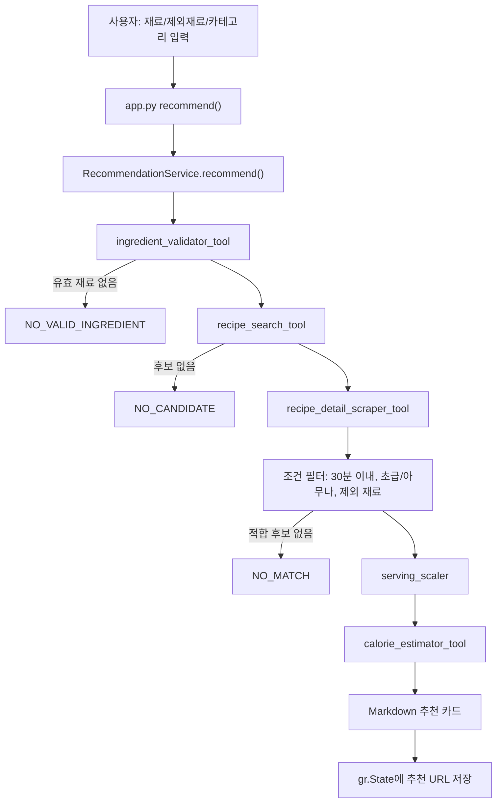

# PRD Final: 자취생 냉장고 털이 레시피 챗봇

| 항목           | 내용                                                                         |
| -------------- | ---------------------------------------------------------------------------- |
| 프로젝트명     | 냉털 레시피 챗봇                                                             |
| 문서명         | PRD Final                                                                    |
| 파일명         | `PRD_Final.md`                                                             |
| 기준일         | 2026-06-25                                                                   |
| 프로젝트 기간  | 2026-06-24 ~ 2026-06-25                                                      |
| 서비스 형태    | Gradio 기반 챗봇 MVP                                                         |
| 실행 진입점    | `python app.py`                                                            |
| 핵심 구현 경로 | `app.py`, `services/`, `tools/`, `clients/`, `models/`, `tests/` |
| 현재 검색 방식 | 만개의레시피 검색 결과 페이지 직접 파싱                                      |
| LLM 사용 범위  | 식재료 판별 보조, 칼로리 추정                                                |

## 1. 거시적 설계 검토

### 1.1 목표 명확성

목표는 자취생이 보유한 식재료와 원하는 음식 카테고리를 입력하면, 만개의레시피에서 조건에 맞는 레시피를 찾아 1인분 기준으로 환산하고 예상 칼로리를 함께 제공하는 Gradio 챗봇 MVP를 완성하는 것이다.

### 1.2 입력과 출력

| 구분 | 내용                                                                                        |
| ---- | ------------------------------------------------------------------------------------------- |
| 입력 | 식재료 목록, 제외 재료 목록, 음식 카테고리, 재추천 요청                                     |
| 처리 | 재료 검증, 레시피 검색, 상세 페이지 파싱, 조건 필터링, 1인분 환산, 칼로리 추정              |
| 출력 | 추천 메뉴, 이미지 URL, 인분, 조리시간, 난이도, 재료 목록, 조리 단계, 예상 칼로리, 원본 링크 |

### 1.3 핵심 설계 결정

- MVP는 빠른 시연과 구현 안정성을 위해 Gradio 단일 앱으로 설계한다.
- UI 이벤트와 추천 로직은 분리하고, `RecommendationService`가 추천 파이프라인을 제어한다.
- 각 Tool은 독립 함수로 분리해 단위 테스트와 장애 원인 추적이 가능하도록 한다.
- 검색은 MVP 단계에서 `10000recipe.com/recipe/list.html`을 직접 요청해 후보 URL을 추출하는 방식으로 설계한다.
- Tavily 연동은 향후 대체 가능한 확장 지점으로 두고, 현재 핵심 추천 경로에는 포함하지 않는다.
- 신규 실행자를 위해 `.env.example`을 제공하되, 실제 API Key는 포함하지 않는다.
- OpenAI API Key는 개인정보이자 과금 가능한 비밀값이므로 저장소와 PRD에 포함하지 않는다. 사용자는 실행 시 본인의 개인 API Key를 `.env` 또는 환경변수에 입력해 기능을 활성화한다.

### 1.4 오류 가능성이 높은 지점

| 위험 지점                    | 원인                                    | 현재 대응                                                                                               |
| ---------------------------- | --------------------------------------- | ------------------------------------------------------------------------------------------------------- |
| 외부 레시피 사이트 구조 변경 | CSS selector 변경                       | fixture 기반 파싱 테스트, fallback selector 일부 적용                                                   |
| OpenAI API Key 미설정        | 보안상 저장소에 API Key를 포함하지 않음 | 사용자가 개인 API Key를 `.env` 또는 환경변수에 설정하면 OpenAI 기반 식재료 판별·칼로리 추정 사용 가능 |
| 검색 결과 품질 변동          | 외부 검색 HTML 의존                     | 후보 없음 상태와 조건 완화 안내                                                                         |
| 콘텐츠 저작권 리스크         | 원본 이미지/조리문구 표시               | `ENABLE_RECIPE_CONTENT_DISPLAY` 설정값으로 표시 정책 분리                                             |
| 재추천 중복                  | URL query, fragment 차이                | URL 정규화로 중복 방지                                                                                  |
| 칼로리 오해                  | LLM 추정값                              | 범위, 신뢰도, 면책 문구 제공                                                                            |

## 2. 프로젝트 개요

### 2.1 한 줄 소개

냉장고에 있는 식재료와 음식 카테고리를 입력하면 자취생이 따라 하기 쉬운 만개의레시피 메뉴를 찾아 추천하는 Gradio 기반 레시피 챗봇이다.

### 2.2 문제 정의

자취생은 냉장고에 남은 재료가 있어도 어떤 음식을 만들 수 있는지 바로 판단하기 어렵다. 일반 검색은 메뉴명을 먼저 알아야 하거나, 조리시간·난이도·인분 조건이 섞여 있어 실제 실행 가능한 레시피를 고르는 데 시간이 든다.

본 서비스는 식재료 입력을 출발점으로 삼아 레시피 후보를 검색하고, 30분 이내·초급/아무나 조건을 만족하는 결과를 우선 추천한다. 인분은 직접 제한하지 않고 1인분 기준으로 재료 양을 환산해 자취생 사용성에 맞춘다.

### 2.3 타깃 사용자

- 냉장고 속 재료로 간단한 식사를 만들고 싶은 자취생
- 요리 경험이 적어 쉬운 난이도 레시피가 필요한 사용자
- 1인분 또는 소량 조리를 선호하는 사용자
- 남은 재료를 활용해 식비와 음식물 폐기를 줄이고 싶은 사용자

### 2.4 핵심 가치

- 메뉴명을 몰라도 재료 기반으로 추천받을 수 있다.
- 식재료가 아닌 입력을 제외하고 이유를 안내한다.
- 조리시간과 난이도 조건을 적용해 실행 가능한 레시피를 우선 제공한다.
- 여러 인분 레시피도 1인분 기준으로 환산해 보여준다.
- 같은 세션에서 이전 추천 URL을 제외하고 재추천할 수 있다.

## 3. 현재 프로젝트 구조

현재 폴더 기준 주요 구조는 다음과 같다.

```text
HomeAlone-KDA4-main/
├── app.py
├── config.py
├── clients/
│   ├── openai_client.py
│   ├── recipe_http_client.py
│   └── tavily_client.py
├── data/
│   ├── ingredient_aliases.json
│   └── known_ingredients.json
├── models/
│   ├── schemas.py
│   └── retry_schemas.py
├── prompts/
│   ├── calorie_estimation.md
│   ├── ingredient_validation.md
│   └── response_format.md
├── services/
│   ├── recommendation_service.py
│   └── serving_scaler.py
├── tools/
│   ├── ingredient_validator_tool.py
│   ├── recipe_search_tool.py
│   ├── recipe_detail_scraper_tool.py
│   ├── calorie_estimator_tool.py
│   └── retry_recommendation_tool.py
├── tests/
│   ├── fixtures/
│   ├── test_app_ui.py
│   ├── test_calorie_estimator_tool.py
│   ├── test_ingredient_validator_tool.py
│   ├── test_openai_client.py
│   ├── test_recipe_detail_scraper_tool.py
│   ├── test_recipe_search_tool.py
│   ├── test_recommendation_service.py
│   ├── test_retry_recommendation_tool.py
│   └── test_serving_scaler.py
├── requirements.txt
├── requirements-dev.txt
├── README.md
├── PRD.md
├── PRD_v1.md
└── PRD_Final.md
```

현재 README에는 `.env.example`이 포함된 구조가 적혀 있지만 실제 폴더에는 `.env.example`이 없다. 최종 제출 전에는 `.env.example`을 추가하는 것이 안정적이다.

## 4. MVP 범위

### 4.1 포함 기능

| 기능                        | 현재 구현 상태                        | 주요 파일                                                                                  |
| --------------------------- | ------------------------------------- | ------------------------------------------------------------------------------------------ |
| Gradio UI                   | 구현됨                                | `app.py`                                                                                 |
| 식재료 입력 동적 추가       | 구현됨, 최대 20개                     | `app.py`                                                                                 |
| 제외 재료 입력 동적 추가    | 구현됨, 최대 20개                     | `app.py`                                                                                 |
| 카테고리 선택               | 구현됨                                | `app.py`                                                                                 |
| 식재료 검증                 | 구현됨                                | `tools/ingredient_validator_tool.py`                                                     |
| 식재료 별칭/사전            | 구현됨                                | `data/*.json`                                                                            |
| 레시피 검색                 | 구현됨, 만개의레시피 검색 페이지 파싱 | `tools/recipe_search_tool.py`, `clients/recipe_http_client.py`                         |
| 상세 페이지 파싱            | 구현됨                                | `tools/recipe_detail_scraper_tool.py`                                                    |
| 30분 이내·초급/아무나 필터 | 구현됨                                | `services/recommendation_service.py`                                                     |
| 1인분 환산                  | 구현됨                                | `services/serving_scaler.py`                                                             |
| 칼로리 추정                 | 구현됨                                | `tools/calorie_estimator_tool.py`, `clients/openai_client.py`                          |
| 재추천                      | 구현됨                                | `app.py`, `tools/retry_recommendation_tool.py`, `services/recommendation_service.py` |
| 단위 테스트                 | 구현됨                                | `tests/`                                                                                 |

### 4.2 MVP 비범위

- 회원가입, 로그인, 사용자별 영구 저장
- DB 기반 추천 이력 저장
- 장바구니, 결제, 가격 비교
- 의료적 의미의 정확한 영양 상담
- 다중 레시피 사이트 통합
- FastAPI 분리 백엔드
- 대규모 트래픽 운영
- Tavily API 기반 실시간 검색 운영 전환

## 5. 사용자 입력 명세

### 5.1 화면 입력

| 입력                |     필수 여부 | 현재 구현                              |
| ------------------- | ------------: | -------------------------------------- |
| 식재료              | 1개 이상 필요 | 기본 3칸, 최대 20칸까지 추가           |
| 제외 재료           |          선택 | 기본 1칸, 최대 20칸까지 추가           |
| 카테고리            |          필수 | 한식, 중식, 일식, 양식, 분식, 상관없음 |
| 추천 버튼           |     필수 액션 | 최초 추천 실행                         |
| 다른 추천 받기 버튼 |     선택 액션 | 이전 URL 제외 후 재추천                |
| 초기화 버튼         |     선택 액션 | 입력, 결과, 상태 초기화                |

### 5.2 내부 입력 제한

| 항목                | 제한                                             |
| ------------------- | ------------------------------------------------ |
| 식재료 최대 개수    | 20개                                             |
| 제외 재료 최대 개수 | 20개                                             |
| 식재료 전체 문자 수 | 300자 이하                                       |
| 카테고리            | 지정된 6개 값 중 하나                            |
| 레시피 URL          | `https://*.10000recipe.com/recipe/{숫자}` 형식 |

## 6. 추천 정책

### 6.1 필수 조건

| 기준      | 정책                                             |
| --------- | ------------------------------------------------ |
| 조리시간  | 파싱 가능한 값 기준 30분 이내                    |
| 난이도    | `초급` 또는 `아무나`                         |
| 인분      | 제외 조건으로 사용하지 않음                      |
| 인분 표시 | 가능한 경우 1인분 기준으로 환산                  |
| 재료      | 유효 재료와 레시피 재료가 1개 이상 관련되어야 함 |
| 제외 재료 | 레시피 재료명에 포함되면 후보 제외               |
| 출처      | 만개의레시피 허용 도메인만 사용                  |

### 6.2 1인분 환산 정책

만개의레시피에는 1인분 레시피가 항상 충분하지 않으므로 인분 수로 후보를 제거하지 않는다. 대신 `RecipeDetail.servings`가 2 이상이면 `services/serving_scaler.py`가 재료 양을 1인분 기준으로 나눈다.

예시:

| 원본 | 4인분 기준 | 1인분 환산 |
| ---- | ---------: | ---------: |
| 밥   |       400g |       100g |
| 김치 |        1컵 |      1/4컵 |
| 소금 |       약간 |       약간 |

수량이 없는 표현이나 숫자가 여러 개인 복합 양은 잘못된 계산을 피하기 위해 원문을 유지한다.

## 7. 핵심 기능 상세

### 7.1 식재료 검증

담당 파일: `tools/ingredient_validator_tool.py`

입력 형식:

```json
{"ingredients": ["김치", "밥", "계란", "핸드폰"]}
```

처리 방식:

1. 문자열, 리스트, 딕셔너리 입력을 표준 목록으로 변환한다.
2. 공백을 정리하고 별칭을 표준 재료명으로 치환한다.
3. 중복 재료를 제거한다.
4. 로컬 사전(`known_ingredients.json`)에 있는 항목은 즉시 유효 처리한다.
5. 사전에 없는 항목은 OpenAI 분류기로 식재료 여부를 판별한다.
6. OpenAI 오류가 발생하면 사전에 없는 항목은 보류 또는 제외하고 서비스가 중단되지 않도록 한다.

출력 모델:

```text
IngredientValidationResult
- valid_ingredients: list[str]
- excluded_items: list[ExcludedItem]
- warnings: list[str]
```

### 7.2 레시피 검색

담당 파일: `tools/recipe_search_tool.py`, `clients/recipe_http_client.py`

현재 구현은 Tavily API가 아니라 만개의레시피 검색 페이지를 직접 요청한다.

검색 URL 예시:

```text
https://www.10000recipe.com/recipe/list.html?q=김치+밥+한식&order=accuracy
```

처리 방식:

1. 유효 재료와 카테고리로 검색어를 만든다.
2. 만개의레시피 검색 결과 HTML을 요청한다.
3. `a.common_sp_link`에서 상세 레시피 링크를 추출한다.
4. `/recipe/{id}` 형식의 HTTPS URL만 남긴다.
5. query string, fragment, trailing slash 차이를 제거해 URL을 정규화한다.
6. 이전 추천 URL 또는 중복 URL은 제외한다.

출력 모델:

```text
RecipeCandidate
- title: str
- url: HttpUrl
- search_score: float | None
```

Tavily 연동은 향후 대체 가능한 확장 지점이다. 현재 `clients/tavily_client.py`는 placeholder 상태이므로 현 버전 PRD에서는 Tavily를 현재 완료 기능으로 보지 않는다.

### 7.3 상세 페이지 파싱

담당 파일: `tools/recipe_detail_scraper_tool.py`

처리 방식:

1. URL이 허용된 만개의레시피 상세 URL인지 검증한다.
2. `clients.recipe_http_client.fetch_recipe_html`로 안전하게 HTML을 가져온다.
3. JSON-LD가 있으면 우선 사용한다.
4. 없거나 부족한 필드는 CSS selector로 보완한다.
5. 제목, 이미지, 인분, 조리시간, 난이도, 재료, 조리 단계를 추출한다.
6. `require_complete=True`일 때 제목, 인분, 조리시간, 난이도가 없으면 후보를 제외한다.

출력 모델:

```text
RecipeDetail
- title: str
- source_url: HttpUrl
- image_url: HttpUrl | None
- servings: int | None
- serving_text: str | None
- cooking_time_minutes: int | None
- cooking_time_text: str | None
- difficulty: str | None
- ingredients: list[IngredientAmount]
- cooking_steps: list[str]
- scraped_at: datetime | None
```

### 7.4 조건 필터와 추천 선택

담당 파일: `services/recommendation_service.py`

추천 파이프라인:

1. 입력 재료 정리
2. 식재료 검증
3. 후보 URL 검색
4. 후보 상세 페이지 파싱
5. 30분 이내 필터
6. `초급` 또는 `아무나` 난이도 필터
7. 제외 재료 포함 여부 검사
8. 보유 재료와 레시피 재료 매칭 수 계산
9. 매칭 수 우선, 동점이면 조리시간 짧은 순으로 선택
10. 선택 레시피를 1인분 기준으로 환산
11. 칼로리 추정
12. Markdown 카드 생성

현재 정렬 기준은 “보유 재료 일치 수 우선, 동점이면 조리시간 짧은 순”이다. 초기 PRD의 더 복잡한 점수화 정책보다 단순하지만, 테스트와 디버깅이 쉬운 MVP 기준에 적합하다.

### 7.5 칼로리 추정

담당 파일: `tools/calorie_estimator_tool.py`, `clients/openai_client.py`

처리 방식:

1. 메뉴명, 재료명, 재료 양, 인분 수만 OpenAI에 전달한다.
2. JSON 객체 응답을 기대한다.
3. `estimated_kcal_per_serving`, `range_min`, `range_max`, `confidence`를 검증한다.
4. 음수, 범위 역전, 중심값 범위 이탈, 필드 누락은 폐기한다.
5. 검증 실패 시 1회 재시도한다.
6. 최종 실패 시 값을 임의 생성하지 않고 `칼로리 추정 불가`를 반환한다.

출력 모델:

```text
CalorieEstimate
- estimated_kcal_per_serving: int | None
- range_min: int | None
- range_max: int | None
- confidence: low | medium | high
- assumptions: list[str]
- disclaimer: str
```

### 7.6 재추천

담당 파일: `tools/retry_recommendation_tool.py`, `app.py`

현재 UI의 `다른 추천 받기` 버튼은 `app.py`의 `retry()`를 통해 기존 추천 URL을 제외하고 `RecommendationService.recommend()`를 다시 호출한다.

`retry_recommendation_tool.py`는 별도의 재추천 상태 모델과 중복 제거 로직을 제공한다.

핵심 정책:

- 이전 추천 URL을 정규화해 제외한다.
- 메뉴명도 정규화해 보조 중복 키로 사용할 수 있다.
- cache 후보가 있으면 우선 사용할 수 있다.
- 새 후보가 없을 때는 같은 결과를 반복하지 않고 조건 변경을 안내한다.

## 8. 화면 구성

담당 파일: `app.py`

### 8.1 주요 컴포넌트

| 컴포넌트        | 역할                                                    |
| --------------- | ------------------------------------------------------- |
| `gr.Markdown` | 제목, 안내, 상태 메시지, 결과 카드 표시                 |
| `gr.Textbox`  | 식재료 입력, 제외 재료 입력                             |
| `gr.Button`   | 식재료 추가, 제외 재료 추가, 삭제, 추천, 재추천, 초기화 |
| `gr.Dropdown` | 음식 카테고리 선택                                      |
| `gr.Chatbot`  | 사용자 요청과 추천 결과 메시지 표시                     |
| `gr.State`    | 이전 추천 URL, 마지막 유효 재료, 제외 재료 상태 저장    |

### 8.2 UI 상태

초기 상태:

```text
previous_recipe_urls: []
last_valid_ingredients: []
last_excluded_ingredients: []
```

기본 식재료 입력 칸은 3개이며 최대 20개까지 추가 가능하다. 제외 재료 입력 칸은 기본 1개이며 최대 20개까지 추가 가능하다.

## 9. 실행 흐름

### 9.1 최초 추천



### 9.2 재추천

1. 사용자가 `다른 추천 받기` 버튼을 누른다.
2. `app.py`가 현재 입력값, 제외 재료, 카테고리, 이전 URL 상태를 읽는다.
3. `RecommendationService.recommend()`에 `exclude_urls`를 전달한다.
4. 검색 또는 후보 필터 단계에서 이전 URL이 제외된다.
5. 새로운 URL이 있으면 상태에 추가한다.
6. 새 후보가 없으면 “더 보여드릴 새로운 레시피가 없어요” 메시지를 표시한다.

## 10. 데이터 모델

주요 모델은 `models/schemas.py`와 `models/retry_schemas.py`에 정의되어 있다.

### 10.1 공통 모델

```text
ExcludedItem
- item: str
- reason: str

IngredientAmount
- name: str
- amount: str | None

IngredientValidationResult
- valid_ingredients: list[str]
- excluded_items: list[ExcludedItem]
- warnings: list[str]

RecipeCandidate
- title: str
- url: HttpUrl
- search_score: float | None

RecipeDetail
- title: str
- source_url: HttpUrl
- image_url: HttpUrl | None
- servings: int | None
- serving_text: str | None
- cooking_time_minutes: int | None
- cooking_time_text: str | None
- difficulty: str | None
- ingredients: list[IngredientAmount]
- cooking_steps: list[str]
- scraped_at: datetime | None

CalorieEstimate
- estimated_kcal_per_serving: int | None
- range_min: int | None
- range_max: int | None
- confidence: Literal["low", "medium", "high"]
- assumptions: list[str]
- disclaimer: str
```

### 10.2 재추천 모델

```text
RetryRecommendationInput
- valid_ingredients: list[str]
- category: Category
- excluded_ingredients: list[str]
- previous_recipe_urls: list[str]
- previous_menu_names: list[str]
- cached_candidates: list[RecommendationResult]

RetryRecommendationOutput
- status: SUCCESS | NO_NEW_CANDIDATE
- recommendation: RecommendationResult | None
- source: CACHE | SEARCH | None
- message: str
- previous_recipe_urls: list[str]
- normalized_menu_names: list[str]
- cached_candidates: list[RecommendationResult]
- warnings: list[str]
```

## 11. 환경변수와 설정

담당 파일: `config.py`

```text
OPENAI_API_KEY=
OPENAI_MODEL=gpt-4o-mini
TAVILY_API_KEY=
REQUEST_TIMEOUT_SECONDS=8
MAX_SEARCH_RESULTS=5
ENABLE_INGREDIENT_CACHE_WRITE=false
ENABLE_RECIPE_CONTENT_DISPLAY=false
```

현재 구현에서 `TAVILY_API_KEY`는 설정값으로는 존재하지만 핵심 검색 경로에서 사용되지 않는다. 검색은 만개의레시피 HTML 파싱으로 동작한다.

`OPENAI_API_KEY`는 개인정보이자 과금 가능한 비밀값이므로 프로젝트 파일에 포함하지 않는 것이 정상 정책이다. 사용자는 실행 전에 본인의 개인 OpenAI API Key를 `.env`에 입력하거나 시스템 환경변수로 설정하면 된다. 키가 설정되면 사전에 없는 식재료 판별과 칼로리 추정 기능을 사용할 수 있고, 키가 없으면 해당 OpenAI 의존 단계는 실패 처리 또는 fallback 정책에 따라 제한적으로 동작한다.

로컬 `.env` 예시:

```text
OPENAI_API_KEY=사용자_개인_OpenAI_API_Key
OPENAI_MODEL=gpt-4o-mini
REQUEST_TIMEOUT_SECONDS=8
MAX_SEARCH_RESULTS=5
ENABLE_INGREDIENT_CACHE_WRITE=false
ENABLE_RECIPE_CONTENT_DISPLAY=false
```

권장 보완:

- `.env.example`을 프로젝트 루트에 추가한다.
- `.env.example`에는 변수명과 예시값만 두고 실제 키는 적지 않는다.
- 실제 키가 들어 있는 `.env`는 Git에 올리지 않는다.
- `ENABLE_RECIPE_CONTENT_DISPLAY=false`를 기본값으로 유지해 콘텐츠 사용 리스크를 줄인다.

## 12. 기술 스택

| 구분       | 기술                          | 현재 사용 목적                   |
| ---------- | ----------------------------- | -------------------------------- |
| Language   | Python 3.12 환경에서 검증됨   | 앱과 테스트 실행                 |
| UI         | Gradio                        | 사용자 입력, 챗봇, 상태 관리     |
| LLM        | OpenAI Python SDK             | 식재료 판별 보조, 칼로리 추정    |
| HTTP       | httpx                         | 만개의레시피 HTML 요청           |
| Parsing    | BeautifulSoup4                | 검색 결과와 상세 페이지 파싱     |
| Validation | Pydantic                      | URL, Tool 결과, 데이터 모델 검증 |
| Env        | python-dotenv                 | `.env` 로드                    |
| Test       | pytest, pytest-asyncio, respx | 단위 테스트와 HTTP mock          |
| DB         | 없음                          | MVP 범위 축소                    |

## 13. 의존성

`requirements.txt`:

```text
gradio
openai
tavily-python
beautifulsoup4
httpx
pydantic
python-dotenv
```

`requirements-dev.txt`:

```text
-r requirements.txt
pytest
pytest-asyncio
respx
```

`tavily-python`은 현재 requirements에는 포함되어 있지만 실제 검색 경로에서는 사용되지 않는다. 향후 Tavily 검색으로 교체할 계획이 없으면 제거를 검토할 수 있다.

## 14. 실행 방법

프로젝트 루트에서 실행한다.

```bash
python3 -m venv .venv
source .venv/bin/activate
pip install -r requirements-dev.txt
python app.py
```

OpenAI 기반 기능까지 정상 사용하려면 실행 전에 `.env` 또는 시스템 환경변수에 개인 API Key를 설정한다.

```text
OPENAI_API_KEY=사용자_개인_OpenAI_API_Key
```

앱 실행 후 Gradio가 출력하는 로컬 URL로 접속한다.

```text
http://127.0.0.1:7860
```

테스트 실행:

```bash
pytest
```

현재 로컬 확인 기준으로 `python app.py`가 실행 진입점이다.

## 15. 예외 처리 정책

| 상황                    | 처리                                                                                                                  |
| ----------------------- | --------------------------------------------------------------------------------------------------------------------- |
| 식재료 미입력           | 유효 재료 없음 메시지 반환                                                                                            |
| 전체 300자 초과         | 검증 단계에서 ValueError                                                                                              |
| 식재료 20개 초과        | 검증 단계에서 ValueError                                                                                              |
| 비식재료 입력           | 제외 항목으로 안내                                                                                                    |
| OpenAI API Key 미설정   | 사용자가 개인 API Key를 설정하면 정상 사용 가능. 미설정 상태에서는 unknown 식재료 판별과 칼로리 추정이 제한될 수 있음 |
| OpenAI 식재료 판별 실패 | 사전 기반 결과만 사용하고 warning 반환                                                                                |
| 검색 요청 실패          | `ERROR` 상태와 재시도 안내                                                                                          |
| 검색 후보 없음          | `NO_CANDIDATE` 상태 반환                                                                                            |
| 상세 페이지 파싱 실패   | 해당 후보 제외 후 다음 후보 진행                                                                                      |
| 30분 초과               | 후보 제외                                                                                                             |
| 난이도 중급 이상        | 후보 제외                                                                                                             |
| 제외 재료 포함          | 후보 제외                                                                                                             |
| 칼로리 추정 실패        | 추천은 유지하고`추정 불가` 표시                                                                                     |
| 재추천 후보 소진        | 조건 변경 안내                                                                                                        |
| 허용 외 URL             | 네트워크 요청 전 또는 redirect 검증에서 차단                                                                          |

## 16. 보안과 안정성

### 16.1 URL 안전성

`normalize_recipe_url()`은 다음을 차단한다.

- HTTP URL
- 만개의레시피 외부 도메인
- 사용자 정보가 포함된 URL
- 포트가 포함된 URL
- `/recipe/{숫자}`가 아닌 경로

`recipe_http_client.py`는 redirect 후에도 허용 도메인을 벗어나지 않는지 재검증한다.

### 16.2 외부 HTML 처리

외부 HTML은 신뢰할 수 없는 입력으로 취급한다. 현재 구현은 필요한 필드만 파싱하며, 조건 판단과 표시용 데이터로 제한해 사용한다.

### 16.3 API Key 관리

OpenAI API Key는 `config.py`에서 환경변수로만 읽는다. 코드, README, PRD, 테스트 fixture에 직접 키를 넣지 않는다.

운영 원칙:

- API Key는 개인정보이자 과금 가능한 비밀값으로 취급한다.
- 저장소에는 실제 키를 포함하지 않는다.
- 사용자는 자신의 개인 API Key를 `.env` 또는 시스템 환경변수에 직접 입력해 사용한다.
- `.env.example`을 둘 경우 실제 키가 아니라 변수명과 더미 예시만 제공한다.
- 키가 없을 때도 앱 자체가 import되거나 UI가 생성되는 흐름은 유지하되, OpenAI 호출이 필요한 기능은 실패 안내 또는 fallback으로 처리한다.

## 17. 자체 시뮬레이션

### 17.1 정상 흐름

입력:

```text
식재료: 김치, 밥, 계란
제외 재료: 양파
카테고리: 한식
```

예상 처리:

1. `collect_ingredient_values()`가 빈 값을 제거한다.
2. `ingredient_validator_tool()`이 김치, 밥, 계란을 유효 재료로 반환한다.
3. `recipe_search_tool()`이 만개의레시피 검색 결과에서 후보 URL을 가져온다.
4. `recipe_detail_scraper_tool()`이 후보별 제목, 인분, 시간, 난이도, 재료를 파싱한다.
5. `RecommendationService`가 30분 초과, 중급 이상, 양파 포함 레시피를 제외한다.
6. 보유 재료 매칭 수가 높은 후보를 선택한다.
7. `serving_scaler`가 1인분 기준으로 재료 양을 환산한다.
8. `calorie_estimator_tool()`이 예상 칼로리 범위를 반환한다.
9. Gradio Markdown에 추천 카드가 표시된다.
10. 추천 URL이 `gr.State.previous_recipe_urls`에 저장된다.

### 17.2 실패 흐름

입력:

```text
식재료: 핸드폰
카테고리: 한식
```

예상 처리:

1. 로컬 사전에서 유효 재료로 찾지 못한다.
2. OpenAI 판별 결과 또는 실패 fallback에 따라 제외/보류된다.
3. 유효 재료가 없으면 검색 Tool을 호출하지 않는다.
4. UI에는 “유효한 식재료가 없어요. 재료를 다시 입력해 주세요.” 메시지가 표시된다.

## 18. 테스트 기준

현재 테스트 파일은 기능 단위로 분리되어 있다.

| 테스트 파일                                  | 검증 대상                                         |
| -------------------------------------------- | ------------------------------------------------- |
| `tests/test_app_ui.py`                     | Gradio 이벤트 함수, 입력칸 추가/삭제, 상태 초기화 |
| `tests/test_ingredient_validator_tool.py`  | 재료 정규화, 중복 제거, OpenAI fallback           |
| `tests/test_recipe_search_tool.py`         | 검색 URL 생성, 후보 파싱, URL 정규화              |
| `tests/test_recipe_detail_scraper_tool.py` | HTML fixture 상세 파싱, 필수 필드 누락 처리       |
| `tests/test_serving_scaler.py`             | 1인분 환산, 분수/한글 수량/복합 수량 처리         |
| `tests/test_calorie_estimator_tool.py`     | 칼로리 JSON 검증, 실패 시 추정 불가               |
| `tests/test_retry_recommendation_tool.py`  | URL/메뉴명 중복 제거, cache/search 재추천         |
| `tests/test_recommendation_service.py`     | 전체 추천 파이프라인, 실패 상태                   |
| `tests/test_openai_client.py`              | OpenAI 응답 파싱                                  |
| `tests/test_recipe_detail_scraper_tool.py` | 상세 페이지 파싱 안정성                           |

필수 테스트 기준:

- 정상 입력 테스트
- 빈 값 테스트
- 중복 데이터 테스트
- 비식재료 테스트
- 외부 API 실패 테스트
- HTML 필드 누락 테스트
- URL 정규화 테스트
- 제외 재료 테스트
- 재추천 중복 방지 테스트
- 1인분 환산 경계값 테스트
- 칼로리 응답 검증 실패 테스트

## 19. 현재 확인된 테스트 결과

이 문서 작성 전 현재 환경에서 다음 검증이 수행되었다.

```text
.venv/bin/python -m py_compile app.py
.venv/bin/python -c "import app; print('demo:', app.demo is not None)"
.venv/bin/python -m pytest
```

확인 결과:

```text
demo: True
86 passed
```

이는 현재 코드가 최소한 import, Gradio demo 생성, 단위 테스트 기준에서 정상 동작함을 의미한다. 단, 외부 사이트와 OpenAI 실시간 호출은 네트워크 상태와 사용자가 입력한 개인 API Key의 유효성에 따라 달라질 수 있다.

## 20. 완료 기준

MVP 완료 기준은 다음과 같다.

- `python app.py`로 Gradio 앱이 실행된다.
- 식재료를 입력하면 유효 재료와 제외 항목이 구분된다.
- 만개의레시피 검색 결과에서 허용된 상세 URL만 후보로 사용한다.
- 상세 페이지에서 인분, 조리시간, 난이도, 재료를 파싱한다.
- 30분 이내, 초급/아무나 조건을 만족하는 후보만 추천한다.
- 인분은 후보 제거 조건이 아니라 1인분 환산 기준으로 사용한다.
- 칼로리는 참고용 추정치로 표시하고 실패 시 값을 위조하지 않는다.
- 재추천 시 이전 URL과 동일한 결과를 반복하지 않는다.
- 테스트가 통과한다.
- API Key는 저장소에 포함하지 않고 사용자가 개인 키를 환경변수로 입력해 사용한다.

## 21. 현재 PRD와 구현 간 차이 정리

| 기존 PRD 표현                       | 현재 구현 기준 수정                                                                |
| ----------------------------------- | ---------------------------------------------------------------------------------- |
| 식재료 입력 5개 고정                | 기본 3개, 최대 20개 동적 입력                                                      |
| 제외 재료는 추가 기능               | 현재 UI에 구현됨                                                                   |
| Tavily 기반 검색                    | 현재는 만개의레시피 검색 HTML 직접 파싱                                            |
| `clients/tavily_client.py` 구현   | placeholder 상태                                                                   |
| `.env.example` 존재               | 현재 폴더에는 없음                                                                 |
| OpenAI API Key 포함                 | 보안상 포함하지 않는 것이 정상이며, 사용자가 개인 API Key를 환경변수로 입력해 사용 |
| 복잡한 추천 점수 정책               | 현재는 매칭 수 우선, 동점 시 조리시간 짧은 순                                      |
| OpenAI 응답 포매팅                  | 현재 핵심 UI 카드는 서비스 계층 Markdown 렌더링                                    |
| 재추천 Tool이 전체 재추천 흐름 주도 | 현재 Gradio 재추천은`RecommendationService`에 `exclude_urls`를 전달하는 방식   |

## 22. 개선 방향

### 22.1 안정성 개선

- `.env.example` 파일 추가
- `.env.example`에는 실제 키 없이 `OPENAI_API_KEY=your_openai_api_key_here` 같은 더미 예시만 제공
- 외부 레시피 사이트 장애 시 발표용 mock/demo mode 추가
- 검색 결과 HTML selector 변경 감지용 smoke test 추가
- `recipe_search_tool`의 사이트 요청 실패 메시지 세분화

### 22.2 유지보수성 개선

- README와 PRD의 실행 구조를 실제 폴더 기준으로 동기화
- Tavily를 계속 사용하지 않을 경우 `tavily-python`, `clients/tavily_client.py`, fixture 이름 정리
- 재추천 로직을 `retry_recommendation_tool` 중심으로 통합할지, 현재 서비스 방식으로 유지할지 결정
- `RecommendationOutcome.status`를 Literal 또는 Enum으로 강화

### 22.3 기능 개선

- 부족한 재료 목록 표시
- 추천 이유 상세화
- 사용자 만족도 피드백 버튼 추가
- 알레르기 또는 비선호 재료 프리셋 제공
- 영양성분 공공 API 기반 칼로리 계산으로 전환
- 검색 후보 cache 도입
- 조리된 음식 이미지 파일 추가

### 22.4 운영 개선

- FastAPI 분리 여부는 다중 클라이언트, 인증, 사용량 제한이 필요해질 때 검토한다.
- Redis 또는 SQLite는 사용자별 이력 저장이 필요할 때 도입한다.
- 콘텐츠 사용 허용 범위가 확인되기 전에는 원본 이미지와 조리문구 저장을 피한다.

## 23. 발표용 핵심 요약

```text
[냉털 레시피 챗봇]

- Python + Gradio 기반 자취생 레시피 추천 MVP
- 사용자는 재료, 제외 재료, 카테고리를 입력
- 식재료 검증 후 만개의레시피에서 후보 검색
- 상세 페이지에서 시간, 난이도, 인분, 재료 파싱
- 30분 이내, 초급/아무나 레시피만 추천
- 여러 인분 레시피도 1인분 기준으로 환산
- OpenAI는 식재료 판별 보조와 칼로리 추정에 제한적으로 사용
- OpenAI API Key는 저장소에 포함하지 않고 사용자가 개인 키를 환경변수로 입력
- 재추천 시 이전 URL 제외
- pytest 기준 86개 테스트 통과
```

## 24. 최종 산출물

- `PRD_Final.md`
- `app.py`
- `config.py`
- `clients/`
- `services/`
- `tools/`
- `models/`
- `prompts/`
- `data/`
- `tests/`
- `README.md`
- `requirements.txt`
- `requirements-dev.txt`

최종 제출 전 권장 추가 산출물:

- `.env.example`
- 실행 화면 캡처
- 발표용 대표 입력/출력 시나리오
- 개인 OpenAI API Key 설정 가이드
- 콘텐츠 사용 범위 확인 메모
